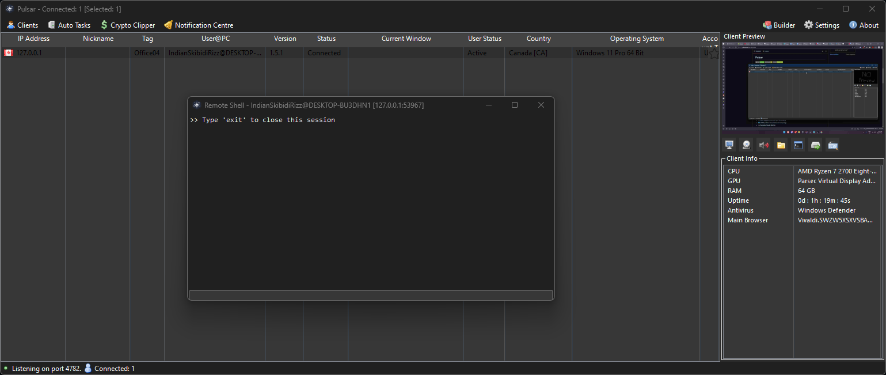
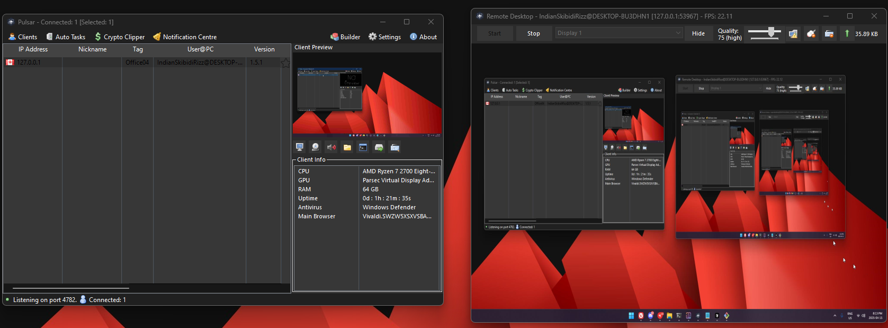
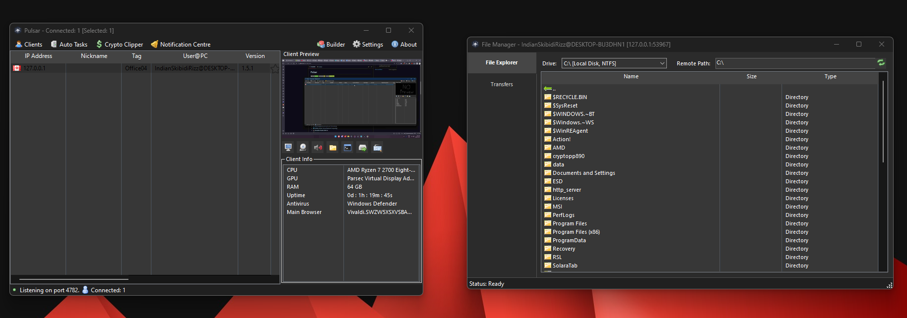

# Pulsar

> **A Free, Open-Source Remote Administration Tool for Windows (Research / Admin Edition)**

Pulsar is a lightweight, fast, and capable remote administration utility written in C#. It is intended for legitimate remote support, systems administration, and controlled research labs. Pulsar provides tools to manage endpoints, transfer files, and assist users remotely with a focus on stability and clarity.

---

## 📖 Table of Contents
- [Need Help or Suggestions?](#-need-help-or-want-to-offer-suggestions)
- [Screenshots](#-screenshots)
- [Key Features](#-key-features)
- [Download](#-download)
- [Getting Started](#-getting-started)
- [Supported Platforms](#-supported-platforms)
- [How to Compile](#-how-to-compile)
- [Contributing](#-contributing)
- [Roadmap](#-roadmap)
- [License](#-license)
- [Security Notice](#-security-notice)
- [Thank You](#-thank-you)

---

## 📸 Screenshots

| **Remote Shell**                  | **Remote Desktop**                | **File Manager**                  |
|-----------------------------------|-----------------------------------|-----------------------------------|
|  |  |  |

---

## ✨ Key Features (framed for admin/research use)

- 🌐 **TCP Network Streams** — IPv4 & IPv6 support for robust connectivity
- ⚡ **Fast Serialization** — Uses Protocol Buffers for efficient data transfer
- 🔒 **Encrypted Communication** — Secure TLS encryption for all traffic
- 📡 **UPnP Support** — Automatic port forwarding for easy setup
- 🖥️ **HVNC** — Hidden Virtual Network Computing for stealthy remote access
- 🕵️‍♂️ **Kematian Gatherer Built-in** — Integrated credential recovery
- 📋 **Task Manager** — View and manage remote processes
- 🗂️ **File Manager** — Browse, upload, and download files remotely
- ⏳ **Startup Manager** — Control startup programs
- 🖧 **Remote Desktop** — Full-featured remote desktop control with DirectX support
- 💻 **Remote Shell** — Command-line access to remote systems
- ⚙️ **Remote Execution** — Run commands and scripts remotely
- ℹ️ **System Information** — Gather detailed system info
- 🔧 **Registry Editor** — Edit the Windows registry remotely
- 🔋 **System Power Commands** — Restart, shutdown, or standby
- ⌨️ **Keylogger** — Unicode-supporting keylogger
- 🌉 **Reverse Proxy** — SOCKS5 proxy support
- 🔑 **Password Recovery** — Extract browser & FTP client passwords
- 🔐 **Escalate / De-escalate Permissions** — Manage privilege levels
- 🚫 **Block IPs** — Block unwanted connections
- 📩 **Telegram Notifications** — Get alerts via Telegram
- 🛡️ **Built-in Obfuscator & Packer** — Protect your builds
- 🛑 **Anti-VM / Anti-Debug** — Evade analysis environments
- 🖼️ **Screen Corrupter / Illuminati** — Fun/experimental features
- 📷 **Webcam Capture** — Capture images from remote webcams
- 🎤 **Microphone Capture** — Record audio from remote microphones
- 💬 **Chat** — Real-time chat with remote users
- 📝 **Remote Script Execution** — Execute PowerShell, Batch, or custom scripts
- **…and much more!**
---

## 📥 Download

- **[Latest Stable Release](https://github.com/XCandlemassX/Pulsar/releases)**

---

## 🚀 Getting Started

1. Download the latest release or clone the repo.  
2. Build the solution or run the provided server binary as instructed.  
3. Use the client-builder to configure target settings for authorized deployments.  

👉 For a complete step-by-step walkthrough, see the [Pulsar Setup Guide](https://github.com/XCandlemassX/Pulsar-setup-guide).  

> **Important:** Only use Pulsar where you have explicit permission. This software is intended for legitimate administrative and research tasks.

---

## 🖥️ Supported Platforms

- .NET Framework 4.5.2 or higher
- Windows (x86/x64): Windows 7 and newer

---

## 🛠️ How to Compile

1. Open `Pulsar.sln` in Visual Studio 2019+ with the ".NET Desktop Development" workload.
2. Restore NuGet packages.
3. Build the solution (Build -> Build Solution).

---

## 🤝 Contributing

See `CONTRIBUTING.md` for contribution guidelines. Contributions should support defensive use, code quality, tests, and documentation.

## 📬 Contact
For inquiries, collaborations, or support:
**Contact:** [XCandlemass](https://t.me/XCandlemass)
---

## 🗺️ Roadmap

See `ROADMAP.md` for planned work and priorities.

---

## 📜 License

Pulsar is licensed under the **MIT License** — see the `LICENSE` file.

---

## 🛡️ Security Notice

Pulsar is a tool for authorized system administration and research. Do not use it on systems where you do not have explicit permission. Misuse may be illegal. The maintainers are not responsible for unauthorized use.

---

## 🙏 Thank You!

If you find this project useful, consider starring the repository and contributing improvements.

